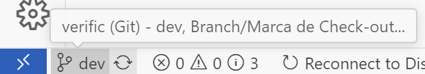

# 🤝 Contribuindo com o Projeto

Olá! 👋  
Este documento tem como objetivo ajudar a padronizar e facilitar a contribuição de todos os membros do grupo.
Mesmo que você não tenha muito contato com Git, aqui vão as orientações básicas que você pode seguir sempre que for contribuir com o projeto:

---

## 🚀 Criando uma branch para cada feature

Sempre que for trabalhar em uma nova funcionalidade (ex: uma tela do frontend ou uma função do backend), crie uma nova branch **antes de começar a programar**.

Você pode criar uma branch com o comando:

```bash
git checkout -b nome-da-sua-branch
```
ou, se preferir, pode usar o comando abaixo para criar e mudar para a nova branch ao mesmo tempo:

```bash
git switch -b nome-da-sua-branch
```

> [!NOTE]
> Caso prefira usar o VS Code, você pode criar uma nova branch clicando no nome da branch atual na parte inferior esquerda do editor e selecionando "Criar nova ramificação".  
> 

**Padrão sugerido para nomes de branches:**

- `front/` para coisas do frontend  
- `back/` para coisas do backend

**Exemplos:**
```
front/login-page
back/authentication
```

> Dica: use nomes curtos, descritivos e em inglês sempre que possível.

---

## ✍️ Commits com mensagens significativas

Ao salvar mudanças com `git commit`, escreva uma mensagem que ajude a entender **o que foi feito**.

### Padrões sugeridos:

- `feat:` para novas funcionalidades  
- `fix:` para correções de bugs  
- `refactor:` para mudanças no código que não alteram a funcionalidade  
- `docs:` para alterações na documentação  
- `style:` para mudanças visuais ou de formatação  

**Exemplo:**
```
feat: added login validation
fix: corrected API endpoint path
```

> ⚠️ As mensagens **devem ser simples**, e se possível, **em inglês**. Se não se sentir confortável escrevendo em inglês, tudo bem — o mais importante é manter o padrão de início (feat, fix, etc).

---

## 🔀 Criando um Pull Request

Quando terminar uma feature ou correção em sua branch, abra um **Pull Request (PR)** para que possamos revisar e integrar ao projeto principal (`main`).

**Como fazer:**

1. Suba sua branch para o GitHub
2. Clique em "Compare & pull request"
3. Preencha um título e uma breve descrição do que foi feito
4. Avisa lá no grupo que a feature ficou pronta

---

## ✅ Checklist antes de criar o PR

- [ ] Criei uma branch separada
- [ ] Escrevi commits claros e no padrão
- [ ] Testei minha funcionalidade (se aplicável)
- [ ] Criei o Pull Request com uma descrição breve

---

## 🗄️ Escrevendo queries com Drizzle

Se você for mexer em queries do banco (`db.query.*`, `db.select()`, subqueries
ou `sql` cru), leia antes **[docs/drizzle-queries.md](../docs/drizzle-queries.md)**.

O resumo: dentro de `db.query.*`, subqueries correlacionadas **precisam** ser
construídas a partir da tabela entregue pelo callback (`(table) => ...`) — nunca
a partir da tabela importada no módulo. Usar a tabela do módulo gera um alias
errado (`"activities"` em vez de `"activity"`) e a query quebra em runtime. Para
reaproveitar filtros entre a query relacional e a de contagem, use uma fábrica
`(table) => ...`.

---

## 🙋‍♂️ Dúvidas?

Se tiver qualquer dúvida sobre Git, código ou qualquer outra coisa, chama no grupo! Pode ser a pergunta de mais alguém :)
